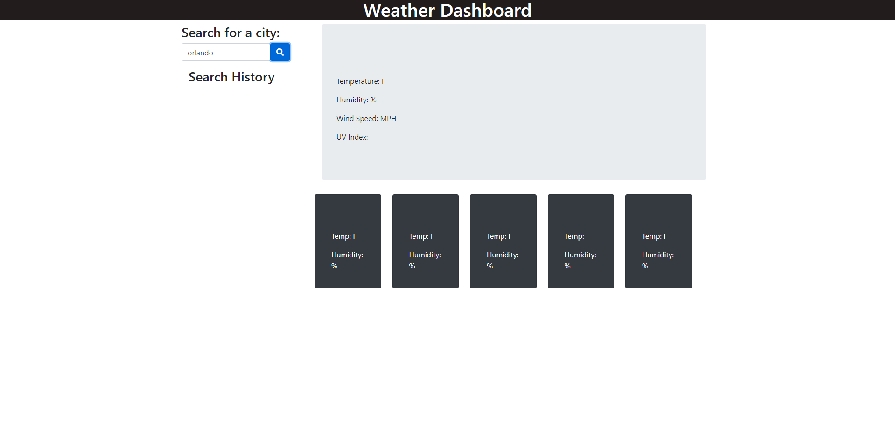

# hw6-weatherDashboard

This homework assignment was to create a weather app that would allow the user to type in the name of a city and get the current day forecast, as well as a 5 day forecast. There would also be a history of searched cities that could be clicked on to display that city's information again. 

I was able to set up the initial HTML page, added a little stlying with CSS, and wrote enough code to get it functional, however I do not yet have the ability to have the saved previous searches.

This project included HTML, CSS, Java script, Bootstrap, OpenWeather API, and fonts awesome. 

## Screenshot of webpage:

